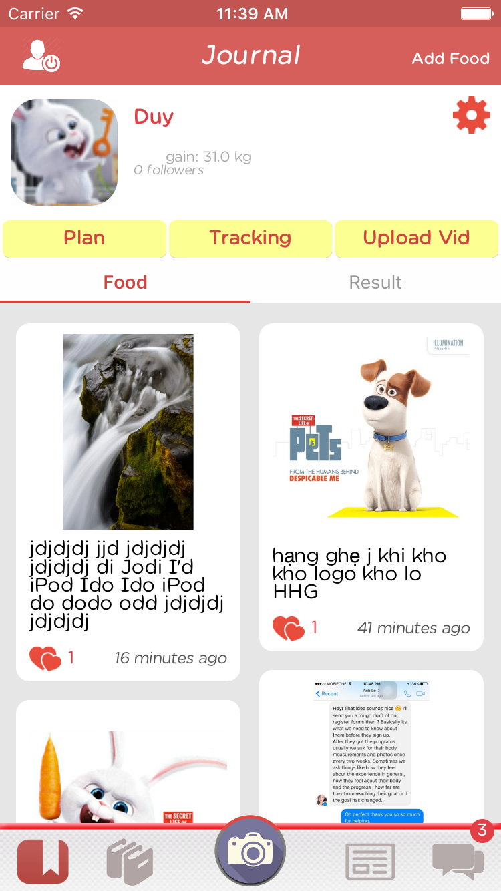

# Final Project - *Healthy Life*

**Healthy Life** - Health and fitness social network app

Time spent: **0** hours spent in total

## User Stories

The following **required** functionality is completed:

- [x] User can sign in using OAuth login flow.
- [x] Use realtime, don't need pull to refresh.
- [x] User profile page

**Demo Lib**

- [x] Demo Exercise library (play uploaded videos)
- [x] User can customize their plan using demo exercise. 
- [x] User can send exercise plan they created to other users

**Personal journal**

- [x] Post picture and description of food (food journal)
- [x] Record activities done  (activities journal)
- [x] Record result pictures and stat (result journal)
- [x] Creating your own plan using demo library or getting plan from your personal trainers (activities planned)
- [ ] Get notification when user start the work out plan you send them. 
- [ ] Get notification when user finish 

**Newsfeeds**

- [x] List of other users profile
- [x] Search by user name 

**Chat**

- [x] Chat with the follower users
- [x] Get notifications when there is new message
- [x] Send photos/videos

The following **optional** features are implemented:

- [ ] Youtube APIs
- [x] Tabbar animation
- [ ] Report plan history

The following **additional** features are implemented:

- [ ] View photo in fullscreen, zoom in/out
- [ ] Share plan / video on Social networks

## Video Walkthrough

Here's a walkthrough of implemented user stories:

GIF created with [LiceCap](http://www.cockos.com/licecap/).

## Notes

Describe any challenges encountered while building the app.

## License

Copyright [2016] [NHD-group: Team 6 - Sy Nguyen, Quang Hieu, Nguyen Duy]

    Licensed under the Apache License, Version 2.0 (the "License");
    you may not use this file except in compliance with the License.
    You may obtain a copy of the License at

        http://www.apache.org/licenses/LICENSE-2.0

    Unless required by applicable law or agreed to in writing, software
    distributed under the License is distributed on an "AS IS" BASIS,
    WITHOUT WARRANTIES OR CONDITIONS OF ANY KIND, either express or implied.
    See the License for the specific language governing permissions and
    limitations under the License.
